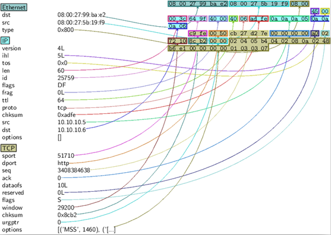

# kyberi

```shell
sysctl -w net.ipv4.ip_forward=1
```

SYN-scan
```python
>>> sr1(IP(dst="72.14.207.99")/TCP(dport=80,flags="S"))
```

```python
>>> ans, unans = sr(IP(dst="10.10.10.6")/TCP(dport=(78,82),flags="S"))
Begin emission:
****Finished to send 5 packets.
*
Received 5 packets, got 5 answers, remaining 0 packets
>>> ans.summary( lambda(s,r): r.sprintf("%TCP.sport% \t %TCP.flags%") )
78 	     RA
finger 	 RA
http 	   SA
81 	     RA
82 	     RA
```

Sniff
```python
>>> sniff(iface="eth0", filter="dst 10.10.10.6", prn=lambda x: x.summary())
Ether / IP / TCP 10.10.10.5:51702 > 10.10.10.6:http S
Ether / IP / TCP 10.10.10.5:51702 > 10.10.10.6:http S
```

PSdump
```python
>>> pkts = sniff(iface="eth0", count=100)
>>> pkts[0].summary()
'Ether / IP / TCP 10.10.10.5:51710 > 10.10.10.6:http S'
>>> pkts[0].psdump("/root/Semi/paketti0.eps",layer_shift=1)
```



Hexdump
```python
>>> hexdump(pkts[0])
0000   08 00 27 99 BA E2 08 00  27 5B 19 F9 08 00 45 00   ..'.....'[....E.
0010   00 3C 64 9F 40 00 40 06  AD FE 0A 0A 0A 05 0A 0A   .<d.@.@.........
0020   0A 06 C9 FE 00 50 CB 27  D2 7E 00 00 00 00 A0 02   .....P.'.~......
0030   72 10 8C B2 00 00 02 04  05 B4 04 02 08 0A 02 48   r..............H
0040   B6 E1 00 00 00 00 01 03  03 07    
```

Pcap
```python
>>> wrpcap("/root/Semi/pkts.cap",pkts)
>>> pkts = rdpcap("/root/Semi/pkts.cap")
```

Packet creation
```python
>>> uusipaketti=Ether()/IP()/TCP()
>>> uusipaketti.summary()
'Ether / IP / TCP 127.0.0.1:ftp_data > 127.0.0.1:http S'
```

```python
>>> ls(Ether)
dst        : DestMACField         = (None)
src        : SourceMACField       = (None)
type       : XShortEnumField      = (36864)
s[0].command()
'Ether(src=\'08:00:27:99:ba:e2\', dst=\'08:00:27:5b:19:f9\', type=2048)/IP(frag=0L, src=\'10.10.10.7\', proto=1, tos=0, dst=\'10.10.10.5\', chksum=59664, len=84, options=[], version=4L, flags=2L, ihl=5L, ttl=64, id=10617)/ICMP(gw=None, code=0, ts_ori=None, addr_mask=None, seq=3, ptr=None, unused=None, ts_rx=None, chksum=61726, reserved=None, ts_tx=None, type=8, id=15841)/Raw(load=\'\\xf43;X\\x00\\x00\\x00\\x00\\xd6\\x9d\\x04\\x00\\x00\\x00\\x00\\x00\\x10\\x11\\x12\\x13\\x14\\x15\\x16\\x17\\x18\\x19\\x1a\\x1b\\x1c\\x1d\\x1e\\x1f !"#$%&\\\'()*+,-./01234567\')'
```

Command funktion
```python
>>> uusipaketti=eval(s[0].command())
>>> uusipaketti.summary()
'Ether / IP / ICMP 10.10.10.7 > 10.10.10.5 echo-request 0 / Raw'
```

Sending packets
```python
>>> sendp(uusipaketti)
.
Sent 1 packets.
```

```python
>>> arpp = ARP(op=2, psrc='10.10.10.6', pdst='10.10.10.5', hwdst='08:00:27:5b:19:f9')
>>> send(arpp)
.
Sent 1 packets.
```

